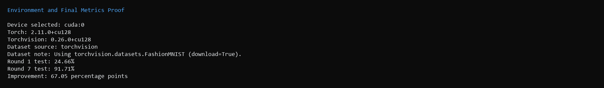
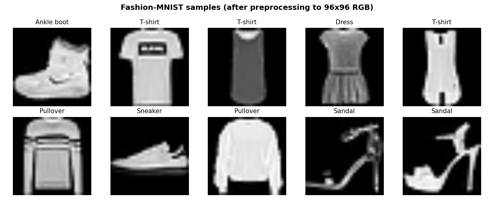
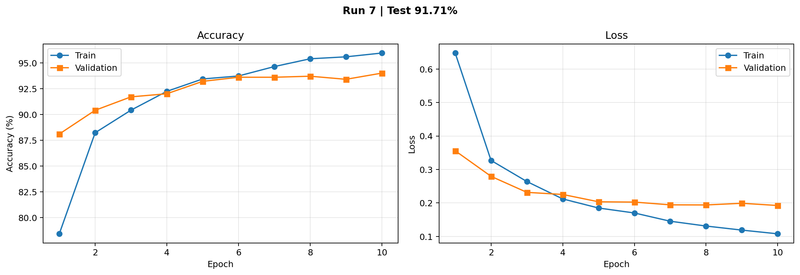
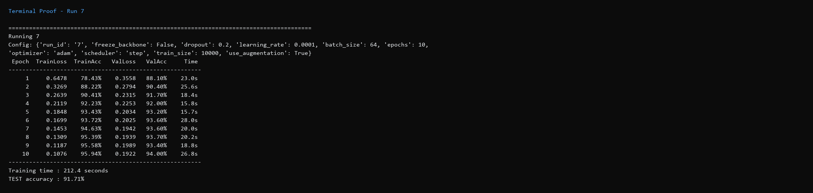
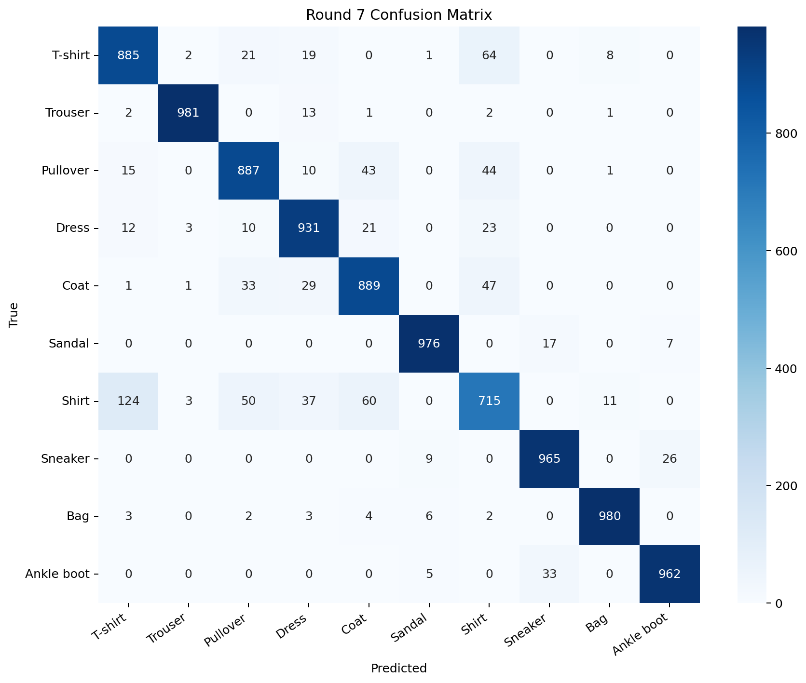

**Hyperparameter Tuning Activity**

_MobileNetV2 + Transfer Learning_

Fashion-MNIST · PyTorch · Jupyter Notebook

Submitted By:

**Lastname, First Name Middle Initial**

Date

# Learning Objectives

By the end of this activity, you will be able to:

- Apply transfer learning - using a model pretrained on millions of images and adapting it to your own task.
- Identify the key hyperparameters of a transfer-learning workflow.
- Diagnose underfitting and overfitting by reading learning curves.
- Understand when to freeze a backbone vs. when to fine-tune it.
- Tune a CNN systematically to reach 90%+ accuracy on Fashion-MNIST.

# Background - MobileNetV2 and Transfer Learning

MobileNetV2 is a lightweight CNN designed for mobile and edge devices. It is efficient because it uses depthwise separable convolutions - splitting each filter into per-channel operations followed by a 1x1 pointwise mix. It has about 2.2 million parameters, small enough to train on a laptop CPU.

### Transfer Learning in Four Steps

Rather than training a CNN from scratch (which needs millions of images and lots of compute), transfer learning starts with a model that already knows how to see:

- Load MobileNetV2 pretrained on ImageNet - 1.2M photos across 1,000 categories.
- Freeze the feature extractor (the Conv2D layers) so its visual knowledge is preserved.
- Replace the final classifier (originally 1,000 classes) with a new one for 10 Fashion-MNIST classes.
- Train only the new classifier - fast and data-efficient.

Later rounds also explore fine-tuning, where you carefully unfreeze some of the backbone for extra accuracy.

# The Dataset - Fashion-MNIST

Fashion-MNIST contains 60,000 training and 10,000 test grayscale images of clothing across 10 classes. It is built into PyTorch via torchvision.datasets.FashionMNIST, so no separate download is needed.

| **Label** | **Class** | **Label** | **Class**  |
| --------- | --------- | --------- | ---------- |
| 0         | T-shirt   | 5         | Sandal     |
| 1         | Trouser   | 6         | Shirt      |
| 2         | Pullover  | 7         | Sneaker    |
| 3         | Dress     | 8         | Bag        |
| 4         | Coat      | 9         | Ankle boot |

# Hyperparameter Explanations

Before you start tuning, take a moment to understand what each knob does. Every training round below will change one of these.

## Transfer Learning Hyperparameters

### FREEZE_BACKBONE

Whether the MobileNetV2 feature extractor is updated during training.

- **True (default in early rounds):** only the small classifier head learns. Fast, stable, but limited ceiling.
- **False (used in Round 4+):** the whole network fine-tunes. Higher ceiling, but requires a much smaller learning rate to avoid destroying pretrained features.

### DROPOUT

Fraction of neurons in the classifier that are randomly "dropped" during training.

- **Range:** 0.0 (no dropout) to 0.5 (aggressive).
- **Purpose:** reduce overfitting. Too high and the model cannot learn; too low and the model memorizes.

## Training Hyperparameters

### LEARNING_RATE

The step size used to update the model's weights on each batch. The single most important hyperparameter.

- **Too large:** weights explode, loss becomes NaN, accuracy collapses.
- **Too small:** training is so slow that the model barely learns in the epochs you run.
- **Typical good values:** 0.001 with a frozen backbone, 0.0001 for fine-tuning.

### BATCH_SIZE

Number of images processed in parallel before the model updates its weights.

- **Smaller (32):** noisier updates, more updates per epoch, slower per epoch but sometimes better generalization.
- **Larger (128, 256):** smoother updates, faster per epoch, but may need more epochs or higher learning rate.

### EPOCHS

How many complete passes through the training data to do.

- **Too few:** underfitting (model has not finished learning).
- **Too many:** risk of overfitting (model memorizes training set instead of learning).

### OPTIMIZER

The algorithm that actually adjusts the weights.

- **'adam':** adaptive, good default for almost any task.
- **'sgd':** classical stochastic gradient descent with momentum. Sometimes generalizes better but needs more tuning.
- **'adamw':** Adam with better weight decay. Modern standard for transfer learning.

### SCHEDULER

Optional mechanism that reduces the learning rate as training progresses.

- **None:** constant learning rate.
- **'step':** cut learning rate by half every few epochs.
- **'cosine':** smoothly decay learning rate from initial value to near zero.

Purpose: take big steps early (fast learning), small steps late (final polish).

## Data Hyperparameters

### TRAIN_SIZE

How many training images to use. The full set has 60,000, but smaller subsets (5,000 to 20,000) train faster for experimentation. More data almost always helps, up to a point.

### USE_AUGMENTATION

Whether to apply random flips and rotations to training images.

- **False:** use each image as-is.
- **True:** each epoch the model sees slightly-varied versions of the images. This multiplies effective data size and reduces overfitting, but often needs more epochs to show its benefit.

# Setup Requirements

### Software

pip install torch torchvision matplotlib numpy

pip install jupyter

### Hardware

- **CPU**: any modern laptop will work. Each round takes roughly 1 to 3 minutes.
- **GPU (CUDA)**: if available, each round takes 10 to 30 seconds. The notebook auto-detects.

### How to Work Through This Worksheet

- Open Jupyter Notebook and create a new notebook (or copy the code cells below into a fresh .ipynb file).
- Run Section 1 (Setup), Section 2 (Dataset), and Section 3 (Model) code ONCE to set up the environment.
- Read Section 4 (Hyperparameter Explanations) above carefully.
- Run Section 5 (Training Helpers) once - these are functions used by every round.
- For each training round: edit the CONFIG code cell with new hyperparameter values, then run the CONFIG cell and the RUN cell. Record your results in the tables provided.
- After Round 7, run the Analysis cells to generate your confusion matrix.
- Answer the reflection questions at the end of this worksheet.

# Section 1 - Setup (run once)

Imports PyTorch and torchvision, detects whether you have a GPU, sets the random seed for reproducibility.

**Section 1 - Setup**

import time

import copy

import numpy as np

import matplotlib.pyplot as plt

import torch

import torch.nn as nn

import torch.optim as optim

from torch.utils.data import DataLoader, Subset

import torchvision

from torchvision import datasets, transforms

from torchvision.models import mobilenet_v2, MobileNet_V2_Weights

device = torch.device("cuda" if torch.cuda.is_available() else "cpu")

print(f"Using device: {device}")

print(f"PyTorch version: {torch.\__version_\_}")

print(f"Torchvision version: {torchvision.\__version_\_}")

SEED = 42

torch.manual_seed(SEED)

np.random.seed(SEED)

# Section 2 - Load the Dataset (run once)

Defines the preprocessing pipeline and downloads Fashion-MNIST. Resizes 28x28 grayscale images to 96x96 RGB and normalizes with ImageNet statistics.

**Section 2 - Dataset**

IMAGENET_MEAN = \[0.485, 0.456, 0.406\]

IMAGENET_STD = \[0.229, 0.224, 0.225\]

basic_transform = transforms.Compose(\[

transforms.Resize(96),

transforms.Grayscale(num_output_channels=3),

transforms.ToTensor(),

transforms.Normalize(mean=IMAGENET_MEAN, std=IMAGENET_STD),

\])

print("Loading Fashion-MNIST...")

train_full = datasets.FashionMNIST(root='./data', train=True, download=True, transform=basic_transform)

test_full = datasets.FashionMNIST(root='./data', train=False, download=True, transform=basic_transform)

print(f" Full training set: {len(train_full):,} images")

print(f" Full test set: {len(test_full):,} images")

CLASS_NAMES = \['T-shirt', 'Trouser', 'Pullover', 'Dress', 'Coat',

'Sandal', 'Shirt', 'Sneaker', 'Bag', 'Ankle boot'\]

Preview a few images:

**Preview Samples**

fig, axes = plt.subplots(2, 5, figsize=(11, 4.5))

for i, ax in enumerate(axes.flat):

img, label = train_full\[i\]

img_show = img.permute(1, 2, 0).numpy()

img_show = img_show \* np.array(IMAGENET_STD) + np.array(IMAGENET_MEAN)

img_show = np.clip(img_show, 0, 1)

ax.imshow(img_show)

ax.set_title(f"{CLASS_NAMES\[label\]}", fontsize=10)

ax.axis('off')

plt.suptitle('Fashion-MNIST samples (after preprocessing to 96x96 RGB)', fontsize=12, fontweight='bold')

plt.tight_layout()

plt.show()

# Section 3 - Build the Model (run once)

Defines the build_model function. Loads MobileNetV2 pretrained on ImageNet, optionally freezes the backbone, and replaces the classifier with a new 10-class head.

**Section 3 - Model**

def build_model(freeze_backbone=True, dropout=0.2):

model = mobilenet_v2(weights=MobileNet_V2_Weights.IMAGENET1K_V1)

if freeze_backbone:

for param in model.features.parameters():

param.requires_grad = False

in_features = model.classifier\[1\].in_features

model.classifier = nn.Sequential(

nn.Dropout(p=dropout),

nn.Linear(in_features, 10)

)

return model.to(device)

def count_trainable_params(model):

trainable = sum(p.numel() for p in model.parameters() if p.requires_grad)

total = sum(p.numel() for p in model.parameters())

return trainable, total

test_model = build_model(freeze_backbone=True, dropout=0.2)

trainable, total = count_trainable_params(test_model)

print(f"Total parameters : {total:,}")

print(f"Trainable parameters : {trainable:,} ({100\*trainable/total:.1f}% of total)")

print(f"\\nBy freezing the backbone, we only train about 0.6% of the network.")

del test_model

# Section 5 - Training Helpers (run once)

These functions handle the standard train/eval loop. You will not need to edit them. They get called from each training round below.

**Helpers - training and evaluation**

def train_one_epoch(model, loader, optimizer, criterion):

model.train()

total_loss, correct, total = 0.0, 0, 0

for images, labels in loader:

images, labels = images.to(device), labels.to(device)

optimizer.zero_grad()

outputs = model(images)

loss = criterion(outputs, labels)

loss.backward()

optimizer.step()

total_loss += loss.item() \* images.size(0)

correct += (outputs.argmax(dim=1) == labels).sum().item()

total += images.size(0)

return total_loss / total, correct / total

@torch.no_grad()

def evaluate(model, loader, criterion):

model.eval()

total_loss, correct, total = 0.0, 0, 0

for images, labels in loader:

images, labels = images.to(device), labels.to(device)

outputs = model(images)

loss = criterion(outputs, labels)

total_loss += loss.item() \* images.size(0)

correct += (outputs.argmax(dim=1) == labels).sum().item()

total += images.size(0)

return total_loss / total, correct / total

**Helpers - run_training**

def run_training(model, train_loader, val_loader, test_loader,

epochs, learning_rate, optimizer_name='adam',

scheduler_type=None):

criterion = nn.CrossEntropyLoss()

params_to_train = \[p for p in model.parameters() if p.requires_grad\]

if optimizer_name == 'adam':

optimizer = optim.Adam(params_to_train, lr=learning_rate)

elif optimizer_name == 'sgd':

optimizer = optim.SGD(params_to_train, lr=learning_rate, momentum=0.9)

elif optimizer_name == 'adamw':

optimizer = optim.AdamW(params_to_train, lr=learning_rate, weight_decay=1e-4)

else:

raise ValueError(f"Unknown optimizer: {optimizer_name}")

scheduler = None

if scheduler_type == 'cosine':

scheduler = optim.lr_scheduler.CosineAnnealingLR(optimizer, T_max=epochs)

elif scheduler_type == 'step':

scheduler = optim.lr_scheduler.StepLR(optimizer, step_size=max(1, epochs//3), gamma=0.5)

history = {'train_loss': \[\], 'train_acc': \[\], 'val_loss': \[\], 'val_acc': \[\]}

print(f"{'Epoch':>6} {'TrainLoss':>10} {'TrainAcc':>9} {'ValLoss':>9} {'ValAcc':>8} {'Time':>8}")

print('-' \* 56)

t0 = time.time()

for epoch in range(1, epochs + 1):

t_epoch = time.time()

train_loss, train_acc = train_one_epoch(model, train_loader, optimizer, criterion)

val_loss, val_acc = evaluate(model, val_loader, criterion)

if scheduler is not None:

scheduler.step()

history\['train_loss'\].append(train_loss)

history\['train_acc'\].append(train_acc)

history\['val_loss'\].append(val_loss)

history\['val_acc'\].append(val_acc)

print(f"{epoch:>6} {train_loss:>10.4f} {train_acc\*100:>8.2f}% "

f"{val_loss:>9.4f} {val_acc\*100:>7.2f}% {time.time()-t_epoch:>7.1f}s")

total_time = time.time() - t0

test_loss, test_acc = evaluate(model, test_loader, criterion)

print('-' \* 56)

print(f"Training time : {total_time:.1f} seconds")

print(f"TEST accuracy : {test_acc\*100:.2f}%")

gap = history\['train_acc'\]\[-1\] - history\['val_acc'\]\[-1\]

if gap > 0.10:

print(f"OVERFITTING: train acc is {gap\*100:.1f}pp higher than val acc")

elif history\['train_acc'\]\[-1\] < 0.50:

print(f"UNDERFITTING: even training accuracy is low")

return history, test_acc

**Helpers - plot_history and make_loaders**

def plot_history(history, title=""):

fig, (ax1, ax2) = plt.subplots(1, 2, figsize=(11, 3.8))

epochs_ran = range(1, len(history\['train_acc'\]) + 1)

ax1.plot(epochs_ran, \[a\*100 for a in history\['train_acc'\]\], 'o-', label='Training')

ax1.plot(epochs_ran, \[a\*100 for a in history\['val_acc'\]\], 's-', label='Validation')

ax1.set_xlabel('Epoch'); ax1.set_ylabel('Accuracy (%)')

ax1.set_title('Accuracy'); ax1.legend(); ax1.grid(alpha=0.3)

ax2.plot(epochs_ran, history\['train_loss'\], 'o-', label='Training')

ax2.plot(epochs_ran, history\['val_loss'\], 's-', label='Validation')

ax2.set_xlabel('Epoch'); ax2.set_ylabel('Loss')

ax2.set_title('Loss'); ax2.legend(); ax2.grid(alpha=0.3)

if title: plt.suptitle(title, fontsize=12, fontweight='bold')

plt.tight_layout(); plt.show()

def make_loaders(train_size=10000, batch_size=64, augment=False):

if augment:

train_transform = transforms.Compose(\[

transforms.Resize(96),

transforms.Grayscale(num_output_channels=3),

transforms.RandomHorizontalFlip(),

transforms.RandomRotation(10),

transforms.ToTensor(),

transforms.Normalize(mean=IMAGENET_MEAN, std=IMAGENET_STD),

\])

train_dataset = datasets.FashionMNIST(root='./data', train=True, download=False,

transform=train_transform)

else:

train_dataset = train_full

n_train = min(train_size, len(train_dataset))

rng = np.random.default_rng(SEED)

all_idx = rng.permutation(len(train_dataset))

n_val = int(0.1 \* n_train)

train_idx = all_idx\[:n_train - n_val\]

val_idx = all_idx\[n_train - n_val:n_train\]

train_subset = Subset(train_dataset, train_idx)

val_subset = Subset(train_full, val_idx)

train_loader = DataLoader(train_subset, batch_size=batch_size, shuffle=True, num_workers=0)

val_loader = DataLoader(val_subset, batch_size=batch_size, shuffle=False, num_workers=0)

test_loader = DataLoader(test_full, batch_size=batch_size, shuffle=False, num_workers=0)

return train_loader, val_loader, test_loader

# Section 6 - Training Rounds

For each round: edit the CONFIG cell with the values specified, run it, then run the RUN cell. Record your results in the tables.

## Round 1 - Baseline (deliberately unrealistic)

The defaults are set to underperform so you can feel the difference tuning makes. Just run the CONFIG and RUN cells as-is.

**CONFIG - Round 1**

FREEZE_BACKBONE = True

DROPOUT = 0.2

LEARNING_RATE = 0.00001

BATCH_SIZE = 64

EPOCHS = 2

OPTIMIZER = 'adam'

SCHEDULER = None

TRAIN_SIZE = 5000

USE_AUGMENTATION = False

**RUN**

train_loader, val_loader, test_loader = make_loaders(

train_size=TRAIN_SIZE, batch_size=BATCH_SIZE, augment=USE_AUGMENTATION)

model = build_model(freeze_backbone=FREEZE_BACKBONE, dropout=DROPOUT)

history, test_acc = run_training(

model, train_loader, val_loader, test_loader,

epochs=EPOCHS, learning_rate=LEARNING_RATE,

optimizer_name=OPTIMIZER, scheduler_type=SCHEDULER)

plot_history(history, f"Test: {test_acc\*100:.2f}%")

Record:

- Test accuracy: 24.66%
- Training time: 9.8 seconds
- Final training accuracy: 18.69%
- Final validation accuracy: 24.60%

_Question: Is the accuracy closer to 10% (random guessing for 10 classes) or 90% (good model)? Look at the learning curves - is the model still improving when training stops?_  
Answer: The result is much closer to random guessing than to a strong model, because 24.66% is still far from 90%. The curves were rising when training stopped at 2 epochs, so the model had not finished learning yet. This round clearly showed underfitting.

## Round 2 - Learning Rate

The baseline learning rate is 100x too small. Try each value below, running the CONFIG and RUN cells for each.

**CONFIG - Round 2**

FREEZE_BACKBONE = True

DROPOUT = 0.2

LEARNING_RATE = 0.001 # <-- CHANGE THIS: try 1.0, 0.1, 0.01, 0.001, 0.0001

BATCH_SIZE = 64

EPOCHS = 3

OPTIMIZER = 'adam'

SCHEDULER = None

TRAIN_SIZE = 5000

USE_AUGMENTATION = False

**RUN**

train_loader, val_loader, test_loader = make_loaders(

train_size=TRAIN_SIZE, batch_size=BATCH_SIZE, augment=USE_AUGMENTATION)

model = build_model(freeze_backbone=FREEZE_BACKBONE, dropout=DROPOUT)

history, test_acc = run_training(

model, train_loader, val_loader, test_loader,

epochs=EPOCHS, learning_rate=LEARNING_RATE,

optimizer_name=OPTIMIZER, scheduler_type=SCHEDULER)

plot_history(history, f"Test: {test_acc\*100:.2f}%")

| **Run** | **LEARNING_RATE** | **Test Accuracy** | **What You Observed** |
| ------- | ----------------- | ----------------- | --------------------- |
| 2a      | 1.0               | 75.33%            | Very large updates; accuracy improved fast but validation was unstable. |
| 2b      | 0.1               | 70.97%            | Better than baseline but still fluctuated across epochs. |
| 2c      | 0.01              | 77.73%            | Stable learning and clear improvement. |
| 2d      | 0.001             | 79.81%            | Best balance of speed and stability; strongest result in this round. |
| 2e      | 0.0001            | 73.72%            | Learning was too slow for only 3 epochs. |

_Question: What happened with LR = 1.0? What about 0.00001? Describe the "Goldilocks zone" where the learning rate was just right._  
Answer: LR=1.0 made updates too aggressive, so validation moved up and down even if training rose. LR=0.00001 from Round 1 was too small and learning stayed slow. The Goldilocks zone in our runs was around 0.001, where training improved steadily and test accuracy reached 79.81%.

**Keep your best LEARNING_RATE (usually 0.001) for all remaining rounds.**

## Round 3 - More Data and More Epochs

Give the model more to work with. Try the four combinations below.

**CONFIG - Round 3**

FREEZE_BACKBONE = True

DROPOUT = 0.2

LEARNING_RATE = 0.001 # your best from Round 2

BATCH_SIZE = 64

EPOCHS = 5 # <-- CHANGE: try 3, 5, 8

OPTIMIZER = 'adam'

SCHEDULER = None

TRAIN_SIZE = 10000 # <-- CHANGE: try 5000, 10000, 20000

USE_AUGMENTATION = False

**RUN**

train_loader, val_loader, test_loader = make_loaders(

train_size=TRAIN_SIZE, batch_size=BATCH_SIZE, augment=USE_AUGMENTATION)

model = build_model(freeze_backbone=FREEZE_BACKBONE, dropout=DROPOUT)

history, test_acc = run_training(

model, train_loader, val_loader, test_loader,

epochs=EPOCHS, learning_rate=LEARNING_RATE,

optimizer_name=OPTIMIZER, scheduler_type=SCHEDULER)

plot_history(history, f"Test: {test_acc\*100:.2f}%")

| **Run** | **TRAIN_SIZE** | **EPOCHS** | **Test Accuracy** |
| ------- | -------------- | ---------- | ----------------- |
| 3a      | 5000           | 3          | 79.81%            |
| 3b      | 5000           | 8          | 80.87%            |
| 3c      | 10000          | 5          | 81.85%            |
| 3d      | 20000          | 5          | 82.79%            |

_Question: Compare 3b (more epochs, same data) with 3c (more data, fewer epochs). Which helped more? Is either setting starting to overfit?_  
Answer: More data helped more than extra epochs in this comparison. Run 3c (81.85%) beat 3b (80.87%) and had a much smaller train-val gap. Run 3b showed early overfitting signs with a larger gap (about 4.64 percentage points).

## Round 4 - Fine-Tuning (unfreeze the backbone)

So far you only trained the tiny classifier head. Now unfreeze the MobileNetV2 backbone.

_Critical: when you unfreeze, you need a MUCH smaller learning rate (10x smaller) to avoid destroying the pretrained features._

**CONFIG - Round 4**

FREEZE_BACKBONE = False # <-- the change

DROPOUT = 0.2

LEARNING_RATE = 0.0001 # <-- much smaller: try 0.001, 0.0001, 0.00001

BATCH_SIZE = 64

EPOCHS = 5

OPTIMIZER = 'adam'

SCHEDULER = None

TRAIN_SIZE = 10000

USE_AUGMENTATION = False

**RUN**

train_loader, val_loader, test_loader = make_loaders(

train_size=TRAIN_SIZE, batch_size=BATCH_SIZE, augment=USE_AUGMENTATION)

model = build_model(freeze_backbone=FREEZE_BACKBONE, dropout=DROPOUT)

trainable, total = count_trainable_params(model)

print(f"Trainable parameters: {trainable:,} / {total:,} ({100\*trainable/total:.1f}%)")

print()

history, test_acc = run_training(

model, train_loader, val_loader, test_loader,

epochs=EPOCHS, learning_rate=LEARNING_RATE,

optimizer_name=OPTIMIZER, scheduler_type=SCHEDULER)

plot_history(history, f"Fine-tuning, LR={LEARNING_RATE} (Test: {test_acc\*100:.2f}%)")

| **Run** | **FREEZE_BACKBONE** | **LEARNING_RATE** | **Test Accuracy** |
| ------- | ------------------- | ----------------- | ----------------- |
| 4a      | True (Round 3 best) | 0.001             | 81.85%            |
| 4b      | False               | 0.001             | 89.88%            |
| 4c      | False               | 0.0001            | 89.48%            |
| 4d      | False               | 0.00001           | 87.04%            |

_Question: What was the trainable parameter count before vs after unfreezing? Did fine-tuning help? What happened in 4b when you used the same LR as Round 3 but with unfrozen weights?_  
Answer: Before unfreezing, trainable parameters were 12,810 out of 2,236,682 (0.6%). After unfreezing, all 2,236,682 parameters were trainable (100.0%). Fine-tuning helped a lot, since accuracy improved from 81.85% (4a) to 89.88% (4b). In 4b, LR=0.001 with unfrozen weights still worked but was less controlled than 0.0001.

## Round 5 - Data Augmentation

Random flips and rotations teach the model to be robust to small variations. Note: augmentation often needs more epochs before it pays off.

**CONFIG - Round 5**

FREEZE_BACKBONE = False

DROPOUT = 0.2

LEARNING_RATE = 0.0001

BATCH_SIZE = 64

EPOCHS = 8 # <-- try 8 and then 12

OPTIMIZER = 'adam'

SCHEDULER = None

TRAIN_SIZE = 10000

USE_AUGMENTATION = True # <-- the change

**RUN**

train_loader, val_loader, test_loader = make_loaders(

train_size=TRAIN_SIZE, batch_size=BATCH_SIZE, augment=USE_AUGMENTATION)

model = build_model(freeze_backbone=FREEZE_BACKBONE, dropout=DROPOUT)

history, test_acc = run_training(

model, train_loader, val_loader, test_loader,

epochs=EPOCHS, learning_rate=LEARNING_RATE,

optimizer_name=OPTIMIZER, scheduler_type=SCHEDULER)

plot_history(history, f"Test: {test_acc\*100:.2f}%")

| **Run** | **USE_AUGMENTATION** | **EPOCHS** | **Train-Val Gap** | **Test Accuracy** |
| ------- | -------------------- | ---------- | ----------------- | ----------------- |
| 5a      | False                | 8          | 7.92%             | 90.24%            |
| 5b      | True                 | 8          | 2.09%             | 91.48%            |
| 5c      | True                 | 12         | 4.03%             | 91.41%            |

_Question: How did the train-val gap change with augmentation? Which run gave the best test accuracy?_  
Answer: Adding augmentation reduced the overfitting gap strongly at the same epoch count (7.92% down to 2.09% from 5a to 5b). With more epochs, 5b gave the best test accuracy at 91.48%. So augmentation improved generalization, and extra training helped push the final score.

## Round 6 - Learning Rate Scheduler

A scheduler reduces the learning rate as training progresses. Large steps early, small steps late.

**CONFIG - Round 6**

FREEZE_BACKBONE = False

DROPOUT = 0.2

LEARNING_RATE = 0.0001

BATCH_SIZE = 64

EPOCHS = 10

OPTIMIZER = 'adam'

SCHEDULER = 'cosine' # <-- try None, 'step', 'cosine'

TRAIN_SIZE = 10000

USE_AUGMENTATION = True

**RUN**

train_loader, val_loader, test_loader = make_loaders(

train_size=TRAIN_SIZE, batch_size=BATCH_SIZE, augment=USE_AUGMENTATION)

model = build_model(freeze_backbone=FREEZE_BACKBONE, dropout=DROPOUT)

history, test_acc = run_training(

model, train_loader, val_loader, test_loader,

epochs=EPOCHS, learning_rate=LEARNING_RATE,

optimizer_name=OPTIMIZER, scheduler_type=SCHEDULER)

plot_history(history, f"Test: {test_acc\*100:.2f}%")

| **Run** | **SCHEDULER** | **Test Accuracy** |
| ------- | ------------- | ----------------- |
| 6a      | None          | 91.46%            |
| 6b      | 'step'        | 91.71%            |
| 6c      | 'cosine'      | 91.92%            |

_Question: Did the scheduler help? Compare the learning curves to Round 5 - does training look smoother in the later epochs?_  
Answer: Yes, scheduling helped a little. Both step and cosine were better than no scheduler, with cosine giving the top score (91.92%). The later epochs also looked more stable than a fixed learning rate.

## Round 7 - Your Best Configuration

Combine everything you have learned. Fill in your best values, run, and record the final accuracy.

**CONFIG - Round 7 (fill in your best values)**

FREEZE_BACKBONE = False

DROPOUT = 0.2

LEARNING_RATE = 0.0001

BATCH_SIZE = 64

EPOCHS = 10

OPTIMIZER = 'adam'

SCHEDULER = 'step'

TRAIN_SIZE = 10000

USE_AUGMENTATION = True

**RUN - Round 7**

train_loader, val_loader, test_loader = make_loaders(

train_size=TRAIN_SIZE, batch_size=BATCH_SIZE, augment=USE_AUGMENTATION)

best_model = build_model(freeze_backbone=FREEZE_BACKBONE, dropout=DROPOUT)

history, test_acc = run_training(

best_model, train_loader, val_loader, test_loader,

epochs=EPOCHS, learning_rate=LEARNING_RATE,

optimizer_name=OPTIMIZER, scheduler_type=SCHEDULER)

plot_history(history, f"BEST (Test: {test_acc\*100:.2f}%)\n\n"

print(f"\\nFINAL TEST ACCURACY: {test_acc\*100:.2f}%")

| **Hyperparameter** | **Your Best Value** |
| ------------------ | ------------------- |
| FREEZE_BACKBONE    | False               |
| DROPOUT            | 0.2                 |
| LEARNING_RATE      | 0.0001              |
| BATCH_SIZE         | 64                  |
| EPOCHS             | 10                  |
| OPTIMIZER          | 'adam'              |
| SCHEDULER          | 'step'              |
| TRAIN_SIZE         | 10000               |
| USE_AUGMENTATION   | True                |

**Final test accuracy: 91.71%**

**Improvement over Round 1: 67.05 percentage points**

# Section 7 - Analyze Your Best Model

Run these cells after Round 7 to see per-class accuracy and generate the confusion matrix.

**Per-class accuracy**

best_model.eval()

correct_per_class = np.zeros(10)

total_per_class = np.zeros(10)

all_preds, all_labels = \[\], \[\]

with torch.no_grad():

for images, labels in test_loader:

images, labels = images.to(device), labels.to(device)

preds = best_model(images).argmax(dim=1)

for lbl in range(10):

mask = (labels == lbl)

correct_per_class\[lbl\] += (preds\[mask\] == lbl).sum().item()

total_per_class\[lbl\] += mask.sum().item()

all_preds.extend(preds.cpu().numpy())

all_labels.extend(labels.cpu().numpy())

print(f"{'Class':&lt;12} {'Accuracy':&gt;10} {'Samples':>10}")

print('-' \* 34)

for i, name in enumerate(CLASS_NAMES):

acc = correct_per_class\[i\] / total_per_class\[i\]

print(f"{name:&lt;12} {acc\*100:&gt;9.1f}% {int(total_per_class\[i\]):>10}")

**Confusion matrix**

all_preds = np.array(all_preds)

all_labels = np.array(all_labels)

cm = np.zeros((10, 10), dtype=int)

for t, pred in zip(all_labels, all_preds):

cm\[t, pred\] += 1

fig, ax = plt.subplots(figsize=(9, 7))

im = ax.imshow(cm, cmap='Blues')

ax.set_xticks(range(10)); ax.set_yticks(range(10))

ax.set_xticklabels(CLASS_NAMES, rotation=45, ha='right')

ax.set_yticklabels(CLASS_NAMES)

ax.set_xlabel('Predicted'); ax.set_ylabel('Actual')

ax.set_title('Confusion Matrix - Your Best Model')

for i in range(10):

for j in range(10):

ax.text(j, i, cm\[i, j\], ha='center', va='center',

color='white' if cm\[i, j\] > cm.max()/2 else 'black', fontsize=8)

plt.colorbar(im, ax=ax, fraction=0.046)

plt.tight_layout()

plt.show()

# Reflection Questions

Answer in complete sentences (3-4 sentences each):

- Biggest jump: Which single hyperparameter change gave you the biggest accuracy jump? Why do you think that was?
- Underfitting vs. overfitting: Describe the difference. Which did you see in Round 1? In Round 4 or 5 if you used enough epochs? What does each look like in the learning curves?
- Why transfer learning works: MobileNetV2 was trained on ImageNet (cats, dogs, cars, etc.). Why does it still help for grayscale clothing images? Link your answer to what the earlier convolutional layers have learned.
- Fine-tuning learning rate: In Round 4 you had to use a much smaller LR when unfreezing the backbone. Explain why in your own words.
- Confusion matrix: Which two classes does your best model confuse most often? Can you guess why from the class names? What could you do to improve those specific classes?
- Next dataset: If you were given a brand new image dataset tomorrow (e.g., medical X-rays), list the first THREE things you would try, in order. Justify your order.