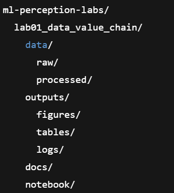

{width="0.38125in"
height="0.45416666666666666in"}{width="0.4548611111111111in"
height="0.4548611111111111in"}**\
MACHINE LEARNING AND PERCEPTION LAB**

**Laboratory Exercise 1\
Data Value Chain, Dataset Acquisition, Organization, and Dataset Card**

Submitted by:

**Group \#**

+------------+--------------+------------+-----------+----------+-----+
| **         | **E          | **Ac       | **M       | **Unacce | **S |
| Category** | xceptional** | ceptable** | arginal** | ptable** | cor |
|            |              |            |           |          | e** |
|            | **4**        | **3**      | **2**     | **1**    |     |
+------------+--------------+------------+-----------+----------+-----+
| **System / | Clear,       | Adequate   | Partial   | Minimal  |     |
| Pipeline   | wel          | pipeline   | or        | or       |     |
| Design &   | l-structured | or         | loosely   | unclear  |     |
| Impl       | machine      | ex         | s         | design   |     |
| ementation | learning     | perimental | tructured | effort;  |     |
| (30%)**    | pipeline or  | design     | design;   | does not |     |
|            | experimental | with minor | some      | address  |     |
|            | design that  | li         | req       | the lab  |     |
|            | fully meets  | mitations; | uirements | requi    |     |
|            | the stated   | meets most | addressed | rements. |     |
|            | objectives,  | lab        | but key   |          |     |
|            | r            | req        | elements  |          |     |
|            | equirements, | uirements. | are       |          |     |
|            | and          |            | missing   |          |     |
|            | constraints  |            | or        |          |     |
|            | of the lab.  |            | i         |          |     |
|            |              |            | ncorrect. |          |     |
+------------+--------------+------------+-----------+----------+-----+
| **A        | Correct      | Correct    | Limited,  | No       |     |
| pplication | selection    | tool       | inapp     | me       |     |
| of Tools & | and expert   | selection  | ropriate, | aningful |     |
| Te         | use of       | with minor | or        | or       |     |
| chniques** | appropriate  | errors or  | incorrect | i        |     |
|            | tools and    | incon      | tool      | ncorrect |     |
| **(25%)**  | techniques   | sistencies | usage;    | use of   |     |
|            | (e.g.,       | in         | t         | required |     |
|            | Python,      | ap         | echniques | tools    |     |
|            | Jupyter, ML  | plication. | partially | and      |     |
|            | libraries,   |            | support   | tec      |     |
|            | data         |            | the task. | hniques. |     |
|            | analysis     |            |           |          |     |
|            | tools);      |            |           |          |     |
|            | methods are  |            |           |          |     |
|            | effectively  |            |           |          |     |
|            | applied and  |            |           |          |     |
|            | justified.   |            |           |          |     |
+------------+--------------+------------+-----------+----------+-----+
| **Impl     | Efficient,   | Functional | Imple     | Poor or  |     |
| ementation | logical, and | impl       | mentation | non-fu   |     |
| & Resource | we           | ementation | partially | nctional |     |
| Uti        | ll-organized | with minor | works but | implem   |     |
| lization** | imp          | inef       | lacks     | entation |     |
|            | lementation; | ficiencies | ef        | with     |     |
| **(20%)**  | methods and  | or         | ficiency, | little   |     |
|            | resources    | red        | clarity,  | consi    |     |
|            | are fully    | undancies. | or        | deration |     |
|            | aligned with |            | comp      | of       |     |
|            | the problem  |            | leteness. | cons     |     |
|            | and          |            |           | traints. |     |
|            | constraints. |            |           |          |     |
+------------+--------------+------------+-----------+----------+-----+
| **Testing, | C            | Adequate   | Limited   | No       |     |
| Analysis & | omprehensive | testing    | testing;  | testing  |     |
| Va         | testing and  | and        | analysis  | p        |     |
| lidation** | analysis;    | analysis   | is        | erformed |     |
|            | results are  | with       | in        | or       |     |
| **(15%)**  | clearly      | mostly     | complete, | results  |     |
|            | validated,   | correct    | weakly    | are      |     |
|            | interpreted, | inte       | s         | inc      |     |
|            | and          | rpretation | upported, | orrectly |     |
|            | supported by | of         | or        | analyzed |     |
|            | appropriate  | results.   | partially | or       |     |
|            | metrics,     |            | i         | inte     |     |
|            | figures, or  |            | ncorrect. | rpreted. |     |
|            | tables.      |            |           |          |     |
+------------+--------------+------------+-----------+----------+-----+
| **Doc      | Clear,       | Complete   | Partial   | Inc      |     |
| umentation | complete,    | doc        | docum     | omplete, |     |
| &          | and          | umentation | entation; | poorly   |     |
| R          | wel          | with minor | missing   | written, |     |
| eporting** | l-structured | issues in  | sections, | or       |     |
|            | lab          | clarity,   | unclear   | missing  |     |
| **(10%)**  | rep          | org        | expl      | docume   |     |
|            | ort/notebook | anization, | anations, | ntation. |     |
|            | with proper  | or detail. | or poor   |          |     |
|            | figures,     |            | orga      |          |     |
|            | tables,      |            | nization. |          |     |
|            | e            |            |           |          |     |
|            | xplanations, |            |           |          |     |
|            | and          |            |           |          |     |
|            | reflection.  |            |           |          |     |
+------------+--------------+------------+-----------+----------+-----+
| **TOTAL    |              |            |           |          |     |
| SCORE**    |              |            |           |          |     |
+------------+--------------+------------+-----------+----------+-----+

  -----------------------------------------------------------------------------
  **Group                                                           
  Members**                                                         
  -------------- ---------------------------- --------------------- -----------
  **STUDENT      **NAME**                     **CONTRIBUTION**      **SCORE**
  NUMBER**                                                          

                                                                    

                                                                    

                                                                    

                                                                    
  -----------------------------------------------------------------------------

Submitted to:

Engr. Dexter James L. Cuaresma

Date:

mm/dd/year

-   Explain and apply the ML Data Value Chain for perception tasks,
    identifying what outputs are produced at each stage.

-   Acquire a public perception dataset and organize it using a standard
    folder structure that supports reproducible ML work.

-   Inspect and summarize the dataset by visual sampling, label listing,
    image shape/format checks, and class distribution analysis.

-   Create a reproducible dataset split (train/validation/test) and
    store split metadata properly.

-   Prepare a complete Dataset Card describing dataset origin, license,
    classes, intended use, limitations, and ethical considerations.

Introduction

Machine Learning for Perception (computer vision, audio perception, and
sensor perception) depends primarily on data readiness. In many
projects, the largest portion of time is spent before training a
model---collecting the right data, organizing it, inspecting quality,
and documenting what it contains.

This lab introduces you to the data-first workflow by focusing on the
earliest and most critical stages: dataset acquisition, dataset
organization, dataset inspection, dataset splitting, and dataset
documentation. These tasks form the backbone of a reliable ML pipeline
and ensure that later labs (cleaning, augmentation, training, tuning,
and evaluation) can be performed correctly and fairly.

**1) Machine Learning Data Value Chain**

The ML Data Value Chain is the **end-to-end sequence of activities**
that turns raw data into a functioning perception system. It can be
summarized as:

1.  **Collect / Acquire Data**

    -   Obtain data from sensors/cameras, manual capture, or public
        repositories.

    -   Output: raw dataset + source documentation.

2.  **Organize & Label Data**

    -   Establish a consistent file structure and label definition
        (class names, label mapping).

    -   Output: organized dataset + label schema.

3.  **Clean & Preprocess Data**

    -   Remove corrupted samples, standardize sizes/formats, normalize
        values.

    -   Output: processed dataset ready for modeling.

4.  **Augment Data (Optional but common)**

    -   Generate transformed variants (flip/rotate/crop/noise, etc.) to
        improve generalization.

    -   Output: training-ready dataset with variability.

5.  **Analyze Data (EDA)**

    -   Examine class distribution, sample variety, outliers, and
        potential bias.

    -   Output: insights and decisions (e.g., balancing approach).

6.  **Train Model**

    -   Choose an algorithm/architecture and fit parameters using the
        training set.

    -   Output: trained model weights and training logs.

7.  **Tune Model**

    -   Adjust hyperparameters (learning rate, batch size, epochs,
        architecture depth).

    -   Output: improved model configuration.

8.  **Evaluate Model**

    -   Use the test set and compute metrics (accuracy, precision,
        recall, F1, confusion matrix).

    -   Output: validated performance report.

9.  **Deploy Model**

    -   Convert and package model for local/cloud/mobile/embedded use.

    -   Output: deployment artifact (e.g., ONNX/TFLite) + runtime
        constraints.

**Why this matters:**\
If the early steps are weak (bad dataset, poor organization, missing
documentation), later steps can produce misleading results. A "high
accuracy" model can be useless if data was incorrectly split or labels
were inconsistent.

**2) Dataset Acquisition is Not "Just Downloading"**

Acquiring a dataset involves:

-   Confirming the **license and usage rights**

-   Understanding the **task** it supports
    (classification/detection/segmentation)

-   Knowing the **label definitions**

-   Checking **data size, resolution, and format**

-   Identifying any **limitations** early (e.g., low diversity, bias)

In professional settings, dataset acquisition always includes
documentation. This is why this lab requires a Dataset Card.

**3) Why Dataset Organization Matters (Reproducibility & Traceability)**

A consistent structure helps you:

-   Avoid mixing "raw" and "processed" data

-   Repeat experiments without confusion

-   Track where files came from and what changes were made

-   Work in teams without breaking each other's files

The "raw → processed → outputs → docs" structure is used in research
labs and industry ML projects.

**4) Splitting the Dataset: The Most Common Hidden Mistake**

The train/validation/test split prevents **data leakage**, a major cause
of fake performance improvements.

-   **Training set -** used to update model weights

-   **Validation set -** used to tune hyperparameters and make training
    decisions

-   **Test set -** used only once you finalize the model, to estimate
    real performance

If you accidentally let the model "see" test samples early (even
indirectly), your final results become unreliable.

**5) Dataset Card: Documentation that Prevents Misuse**

A Dataset Card supports:

-   Transparency - "Where did this come from?"

-   Fairness - "Are some classes underrepresented?"

-   Accountability - "Can this be used safely?"

-   Reusability - "Can someone else reproduce my dataset?"

In modern AI practice, documentation is part of responsible AI
development.

**Hardware**

-   Laptop/PC with at least 8GB RAM (recommended)

> **Software**

-   Python 3.10+

-   Jupyter Notebook / Google Colab

> **Libraries**

-   numpy

-   pandas

-   matplotlib

-   scikit-learn

-   torch

-   torchvision

**Dataset / Data Source**

-   CIFAR-10 (10-class image dataset, widely used for classification).

-   Accessed via torchvision.datasets. CIFAR10 (auto-download).

**Part A)** Environment Setup and Verification

1.  Create a folder named: **ml-perception-labs**

2.  Inside it, create: **lab01_data_value_chain/**

3.  {width="1.8750142169728783in"
    height="2.0729319772528436in"}Create the following directory
    structure:

4.  Create a new notebook named:\
    **notebook/Lab01_DataValueChain_DatasetAcquisition.ipynb**

5.  In the notebook:

    1.  Print your **name**, **section**, and **date**

    2.  Print your **Python version**

    3.  Import required libraries and confirm there are no errors

> **Checkpoint (must be shown in notebook):**\
> A screenshot or output cell showing imports were successful.

**Part B)** Dataset Acquisition (CIFAR-10 Download and Load)

1.  Use torchvision to **download CIFAR-10** into:\
    data/raw/

2.  Confirm and record:

    -   Total number of training samples

    -   Total number of test samples

    -   List of class names

    -   Image format (height × width × channels)

    -   Data type (e.g., uint8, float)

3.  Print the first 5 samples:

    -   Show their label ID

    -   Show their class name

    -   Show the raw image shape

> **Checkpoint:**\
> A visible cell output listing: dataset size, class names, image shape.

**Part C)** Dataset Exploration Through Visual Sampling

1.  Randomly select **at least 20 images**

2.  Display them in a grid with:

    -   image

    -   class name label

3.  Repeat sampling with a different random seed and display another
    grid (optional but encouraged)

> **Checkpoint:**\
> At least **one saved figure**: outputs/figures/lab01_samples.png

**Part D)** Dataset Label Mapping and Class List

1.  Create a label mapping table:

    -   label_id (0--9)

    -   class_name

2.  Save the table to:

    -   outputs/tables/lab01_label_mapping.csv

> **Checkpoint:**\
> CSV file exists and displayed in notebook.

**Part E)** Class Distribution Analysis

1.  Compute the number of samples for each class in the dataset

2.  Display:

    -   A table of counts per class

    -   A bar chart of counts per class

3.  Identify:

    -   Which class has the highest count

    -   Which class has the lowest count

    -   Whether dataset is balanced (explain)

Save:

-   outputs/tables/lab01_class_distribution.csv

-   outputs/figures/lab01_class_distribution.png

> **Checkpoint:**\
> Table and chart shown in notebook and saved files.

**Part F)** Dataset Splitting (Train / Validation / Test)

In this part, you will divide the dataset into **training**,
**validation**, and **test** sets to ensure fair model development and
evaluation.

> **Required Split**

-   Training set: 70%

-   Validation set: 15%

-   Test set: 15%

1.  Combine all available dataset samples into a single list.

2.  Set a **random seed** (use 42) to ensure reproducible results.

3.  Randomly split the dataset into:

    -   70% for training

    -   15% for validation

    -   15% for testing

4.  Generate and store the indices for each split.

5.  Save the split indices as CSV files in the folder:

> outputs/tables/
>
> train_indices.csv
>
> val_indices.csv
>
> test_indices.csv

**\
A. Dataset Summary**

-   Dataset name

-   Number of images

-   Image dimensions

-   Number of classes

-   Class names

**B. Sample Visualization**

-   Include the figure of random samples

-   3--5 sentences describing what you observe (variety, difficulty,
    similarity between classes)

**C. Class Distribution**

-   Show the distribution table and chart

-   3--5 sentences: balanced/imbalanced and why it matters for model
    learning

**D. Split Summary and Justification**

-   Present counts for train/val/test

-   Explain the role of validation vs test (at least 4 sentences)

**E. Ethical and Data Risk Notes**

-   Provide at least 2 risks and 2 mitigation actions

**Questions (Answer Individually)**

Answer in the notebook in your own words:

1.  List the stages of the ML Data Value Chain and give **one output
    artifact** produced in each stage.

2.  What is **data leakage** and how can it happen during dataset
    splitting?

3.  Why should raw data and processed data be stored in separate
    folders?

4.  If two classes look visually similar (e.g., cat vs dog), how might
    this affect dataset labeling and model performance?

5.  Give **two reasons** why a Dataset Card is important in real ML
    projects.

Write a conclusion (8--10 sentences) including:

-   What dataset you used and how you acquired it

-   Key observations during sampling and distribution analysis

-   How you structured your dataset and why

-   Why splitting and documentation are critical before training
